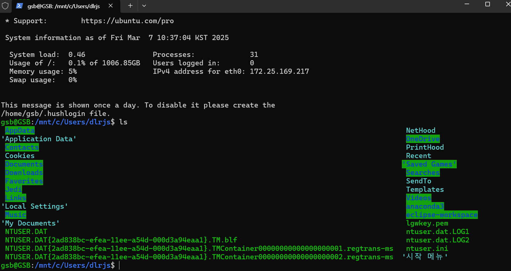

# 📝 1주차 학습 정리

## 📅 날짜
- 2025-03-07

## 📌 주제
- 시스템 프로그래밍 오리엔테이션
- wsl 설치

---

## 📖 이론 정리
### 🔹 시스템 프로그래밍
- 운영체제와 직접 상호작용하는 프로그램을 개발하는 과정
- 커널, 시스템 호출, 메모리 관리, 파일 시스템 등의 개념 포함
- 응용 프로그램과 OS 사이의 인터페이스를 다룸

### 🔹 학습 목표
- 시스템 프로그래밍의 개념 이해
- 리눅스 환경에서 프로그램을 실행하고 개발하는 방법 익히기
- WSL을 활용한 개발 환경 구축

---

## 🛠️ 실습 내용 (해당하는 경우)
 WSL 설치 방법
1. **PowerShell(관리자 권한)에서 WSL 활성화**
   ```powershell
   wsl --install
   wsl --install -d -Ubuntu-24.04
   wsl --set-version Ubuntu 2
2. **wsl에서 디렉토리 리스트 출럭**
   
