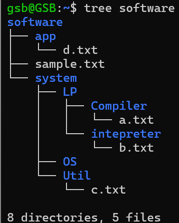

# 📝 2주차 학습 정리

## 📅 날짜
- 2025-03-14

## 📌 주제
- 리눅스 디렉토리 구조 및 기본 명령어

---

## 📖 이론 정리

### 🔹 리눅스 디렉토리 개념
- 리눅스 파일 시스템에서 사용하는 기본 디렉토리 개념
- 경로 탐색을 위한 기본적인 심볼
  - `.` : 현재 디렉토리
  - `..` : 부모 디렉토리
  - `/` : 루트 디렉토리
  - `~` : 홈 디렉토리

### 🔹 명령어 정리
- `man [명령어]`  
  - 해당 명령어의 매뉴얼을 출력하여 사용법을 확인할 수 있음
- `tree`  
  - 특정 디렉토리(혹은 전체 시스템)의 구조를 트리 형태로 출력
  - `sudo apt install tree`로 설치 후 사용 가능
- `mkdir [디렉토리명]`  
  - 새로운 디렉토리를 생성
- `cat` 명령어를 이용한 텍스트 파일 생성
  - cat > 파일이름.txt
  - 이후 원하는 내용을 입력한 후
  - Ctrl + D를 눌러 저장

---

## 🛠️ 실습 내용
 WSL 설치 방법
1. **tree 명령어 설치 및 실행**
   ```powerShell
    sudo apt update
    sudo apt install tree
    tree
2. **cat, mkdir 명령어로 디렉토리와 텍스트 파일 생성**
   ```powerShell
   mkdir software
   cat > a.txt
   i am a
   tree software
   ```
   
