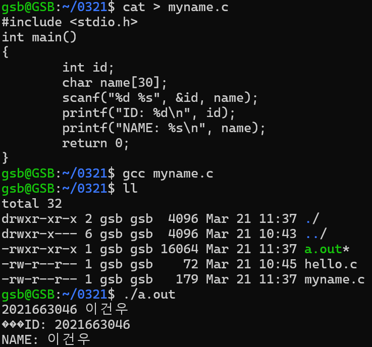

# 📝 3주차 학습 정리

## 📅 날짜
- 2025-03-21

## 📌 주제
- 사용자 및 디렉토리 명령어 실습
- 파일 처리 명령어 익히기
- C 프로그램 컴파일 및 실행

---

## 📖 이론 정리

### 🔹 사용자 및 권한 관련 명령어
- `su`
  - 사용자 전환 명령어 (교수님이 비밀번호를 까먹으심)
- `passwd`
  - 사용자 비밀번호 변경
- `whoami`, `pwd`
  - 현재 사용자 확인, 현재 디렉토리 경로 출력

### 🔹 디렉토리 및 파일 탐색 명령어
- `ls [경로]`
  - 디렉토리 리스트 출력
  - `ls /home/`, `ls /usr/bin/??` 등 사용
  - `*` : 모든 것, `?` : 한 글자
- `ll`
  - `ls -alF`의 alias
  - `-a`: 숨김 포함, `-l`: 상세정보, `-F`: 파일타입 식별기호(예: 실행파일 `*`, 디렉토리 `/`)
- `alias`
  - 명령어 단축어 확인
- `cd`
  - 디렉토리 이동, 인자 없으면 홈 디렉토리로
- `clear`
  - 터미널 화면 정리
- `whatis [명령어]`
  - `man`보다 간단한 설명 제공
- `man [명령어]`
  - 명령어 설명 매뉴얼 출력

### 🔹 디렉토리 및 파일 생성/삭제
- `mkdir [-p]`
  - 디렉토리 생성, `-p` 옵션은 중간 경로도 생성
- `rmdir`
  - 빈 디렉토리 삭제
  - 리눅스는 모든 것을 파일로 인식하므로, 삭제 시 주의
  - 최하위 디렉토리부터 삭제하는 것이 정석
- `touch [파일명]`
  - 빈 파일 생성, 존재할 경우 타임스탬프 갱신
- `cat > [파일명]`
  - 파일 생성 및 내용 입력, `Ctrl + D`로 종료
- `cat [파일명]`
  - 파일 내용 출력
- `more [파일명]`
  - 페이지 단위로 파일 내용 출력 (스페이스로 다음 페이지)
- `head [파일명]`
  - 파일 앞부분 10줄 출력
- `tail [파일명]`
  - 파일 뒷부분 10줄 출력
- `wc [파일명]`
  - 파일의 라인 수, 단어 수, 바이트 수 출력

### 🔹 C 프로그램 컴파일 및 실행
- `gcc [파일명]`
  - C 소스 파일을 컴파일하여 실행 파일(`a.out`) 생성
- `ll`
  - 생성된 `a.out` 파일 확인 및 속성 출력
- `./a.out`
  - 컴파일된 프로그램 실행

---

## 🛠️ 실습 내용

1. **학번과 이름을 입력받는 C파일 생성과 실행**
   ```bash
   cat > myname.c
   #include <stdio.h>
   int main()
   {
     int id;
     char name[30];
     scanf("%d %s", &id, name);
     printf("STUDENTID: %d\n", id);
     printf("NAME: %s\n", name);
     return 0;
   }
   gcc myname.c
   ll
   ./a.out
   ```
   